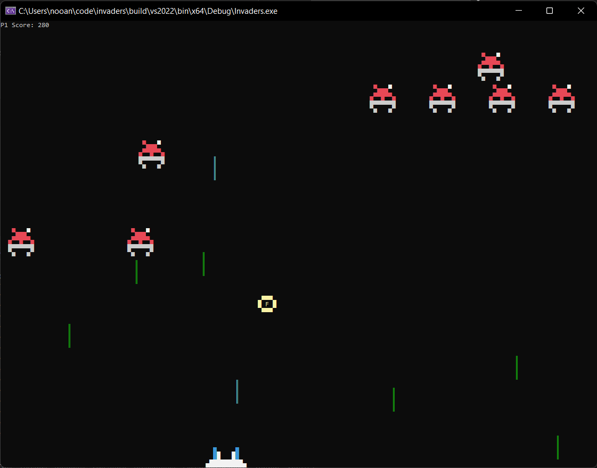

# IKA Invaders
IKA Invaders is an open-source, cross-platform clone of space invaiders, with ASCII graphics.

## Features
* ASCII graphics
* Dynamic gameplay
* Written in C++ 17
* Running on Windows and Linux
* Christmas edition !

## Credits
* Code and graphics by [Stefano Lanza](steflanz@gmail.com)

## Requirements
* C++ 17 compiler

## Installation
* Clone the github repository to a folder (ROOT) on your machine 
  `git clone https://github.com/StefanoLanza/invaders.git`  
* For a Windows build
  * Install the latest release of [premake5](https://premake.github.io/download)
  * cd %ROOT%
  * Run `premake5 vs2022`. You can target previous versions of Visual Studio (e.g. `vs2017` or `vs2019`) 
    This command generates a Visual Studio solution
  * Open %ROOT%/build/vs2022/Invaders.sln in Visual Studio
  * Choose the build configuration
  * Build the solution
* For a Linux build
  * Install the latest release of [premake5](https://premake.github.io/download)
  * cd %ROOT%
  * Run `premake5 gmake`. This generates makefile(s) under build/gmake
  * Run `make -C build/gmake config=release_x64` or another configuration

## Third Party Libraries
  * inih - simple .INI file parser

## Future Work
* New game mechanics
* More animations, power ups and sound effects
* Scoreboard
* android, macOS and iOS ports